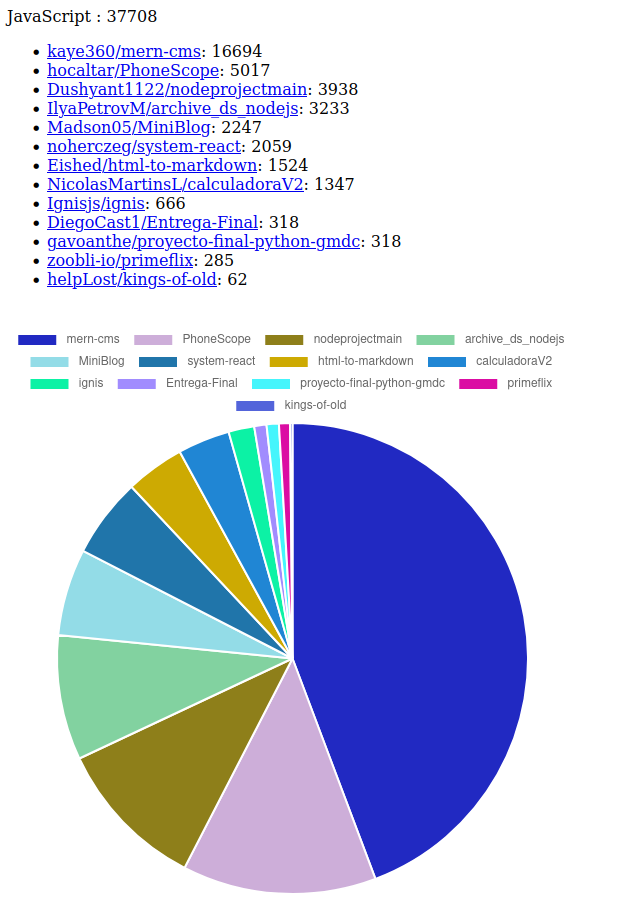

# GitHub Last Language

## Présentation

Mini-serveur HTTP affichant les derniers projets publics sur GitHub utilisant un langage.

Par défaut, le serveur fonctionne sur le port 8080 et propose deux routes :

- `index` : Propose un formulaire pour entrer son langage.

- `search` avec un paramètre `language`, par ex. `search?language=Go` : Page affichant les derniers projets GitHub
  utilisant le langage en paramètre.



## Installation

```shell
go get -u github.com/discowzombie/github-last-language
```

## Fonctionnement

Lorsqu'un utilisateur va rechercher les derniers projets dans un langage via la page `search`, le programme va réaliser
une requête à l'[API GraphQL de GitHub](https://docs.github.com/en/graphql). Ces résultats vont ensuite être filtrés
pour en extraire les lignes de code et le tout sera affiché (par ordre décroissant) à l'utilisateur via une liste et un diagramme.

Pour fonctionner, l'utilisateur doit avoir au préalable défini la variable d'environnement `GITHUB_TOKEN`, étant donné
que l'API GraphQL n'est pas accessible sans authentification. Cette variable doit contenir un 
[jeton d'accès obtenu depuis GitHub](https://github.com/settings/tokens). Ce jeton doit contenir au minimum
l'accès `public_repo`.

## Dépendances

Ce projet utilise [Gin](https://gin-gonic.com/) pour le serveur HTTP ainsi
que [shurcooL/githubv4](https://github.com/shurcooL/githubv4) et [oauth2](https://github.com/golang/oauth2) pour
intéragir avec l'[API GraphQL de GitHub](https://docs.github.com/en/graphql).

La page `search.html` utilise [Chart.js](https://www.chartjs.org).

## Licence

Ce projet est sous [licence MIT](LICENSE).